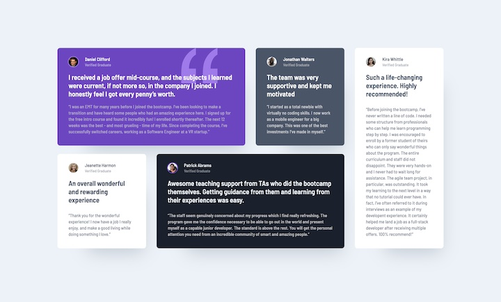

# Frontend Mentor - Testimonials grid section solution

This is a solution to the [Testimonials grid section challenge on Frontend Mentor](https://www.frontendmentor.io/challenges/testimonials-grid-section-Nnw6J7Un7). Frontend Mentor challenges help you improve your coding skills by building realistic projects. 

## Table of contents

- [Overview](#overview)
  - [The challenge](#the-challenge)
  - [Screenshot](#screenshot)
  - [Links](#links)
- [My process](#my-process)
  - [Built with](#built-with)
  - [What I learned](#what-i-learned)
  - [Useful resources](#useful-resources)
- [Author](#author)

## Overview

### The challenge

Users should be able to:

- View the optimal layout for the site depending on their device's screen size

### Screenshot

### Links

- Solution URL: [https://github.com/webdevbynight/testimonials-grid-section-main](https://github.com/webdevbynight/testimonials-grid-section-main)
- Live Site URL: [https://webdevbynight.github.io/testimonials-grid-section-main/](https://webdevbynight.github.io/testimonials-grid-section-main/)

## My process

### Built with

- Semantic HTML5 markup
- CSS (via SCSS)
  - custom properties
  - logical properties
  - grid
- Mobile-first workflow
- Microdata

### What I learned

Google Chrome and Blink-based browsers (Chrome 128 at the time I wrote these lines) do not support side-relative values (such as `bottom 10%`) in the `background-position-x` and `background-position-y` properties, while they do in the `background-position` property. Firefox and Safari support them in all these properties.

### Useful resources

- [Can I use… CSS property: `background-position-x`: Side-relative values](https://caniuse.com/mdn-css_properties_background-position-x_side-relative_values) - This helped me about browsers compatibility of the use of side-relative values in `background-position-x`.
- [Can I use… CSS property: `background-position-y`: Side-relative values](https://caniuse.com/mdn-css_properties_background-position-y_side-relative_values) - This helped me about browsers compatibility of the use of side-relative values in `background-position-y`.

## Author

- Website - [Victor Brito](https://victor-brito.dev)
- Frontend Mentor - [@webdevbynight](https://www.frontendmentor.io/profile/webdevbynight)
- Mastodon - [@webdevbynight](https://mastodon.social/webdevbynight)
